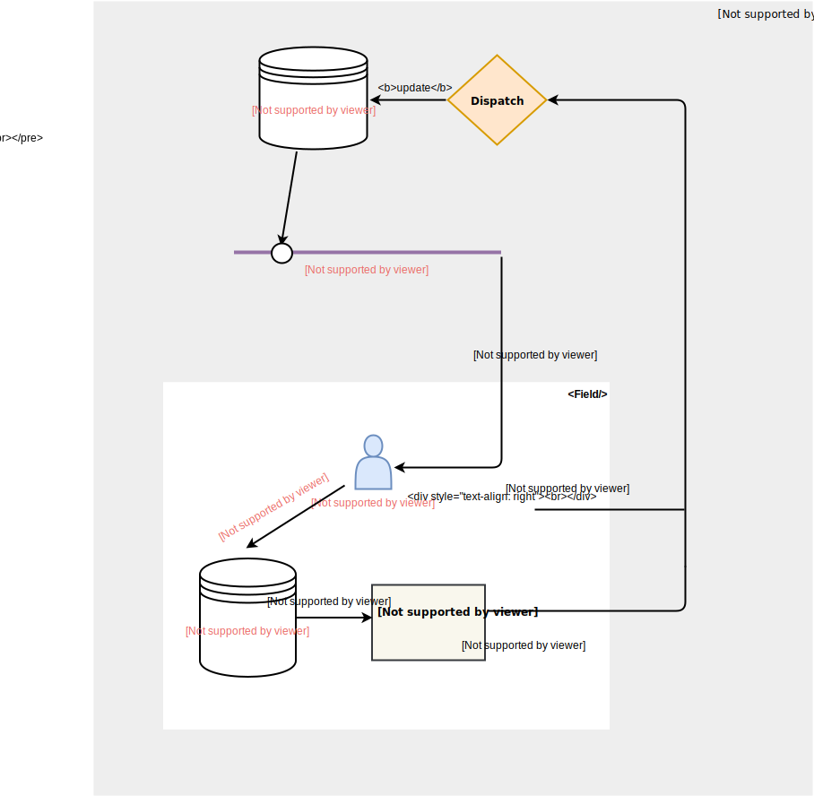

# React Rx Form

### Install

`npm install @react-rx/form`

### Usage

```ts
import React, { Component } from "react";
import { Field, RxForm } from "@react-rx/form";

export class ContactForm extends Component {
  onSubmit = (formValues: any) => {
    console.log(formValues);
  };

  render() {
    return (
      <RxForm>
        {({ handleSubmit }) => (
          <form onSubmit={handleSubmit(this.onSubmit)}>
            <Field name="firstName">
              {({ value, onChange }) => (
                <input value={value} onChange={onChange} type="text" placeholder="First Name" />
              )}
            </Field>
            <button type="submit">Submit</button>
          </form>
        )}
      </RxForm>
    );
  }
}
```

## API

### RxForm

- `initialValues: { [fieldName: string]: TFieldValue }`

  Form initial values

- `children: (props) => ReactNode`

  A render prop, which provide the following props to it's children:

  - `handleSubmit: (onSubmit: TOnSubmit) => (formEvent: React.FormEvent) => any`

  - When `handleSubmit` function fired, `onSubmit` will be called with the following parameters: 
 	 - `values: { [fieldName: string]: TFieldValue }`
 	 - `onSubmitError: (errors: { [fieldName: string]: TErrorMsg }) => any`

### Field

The Field Component is connect each individual input to RxForm.

- `name: string`
  
  Field name
  
- `children: (props) => ReactNode`

  A render prop, which provide the flowing props to it's children:

	- `name: string`
	- `onChange: (value: React.MouseEvent | TFieldValue) => void`
	- `onBlur: (value: React.MouseEvent | TFieldValue) => void`
	- `onFocus: () => void`
	- `value?: TFieldValue`
	- `meta`
	  - `dirty?: boolean`
	  - `touched?: boolean`
	  - `visited?: boolean`
	  - `error?: TErrorMsg`

- `defaultValue?: TFieldValue` 
	
	Field default value
	
- `validate?: TValidator | TValidator[]`
	- TValidator is a function which returns error message based on field value. 
		- `(value: TFieldValue) => string | undefined` 
	- Default be called when field `onChange` and form `startSubmit`
- `format?: (value: TFieldValue) => TFieldValue`
  
  Format field value to be displayed in field input. For example, we can format number to currency. Should be used with `parse` in pairs.
  
- `parse?: (value: TFieldValue) => TFieldValue`
  
  Parse field input display value to be stored in RxForm. Should be used with `format` in pairs
  
- `destroyValueOnUnmount?: boolean` 

 	When field unmount, determine whether to destroy the field value or not

## 数据流



为了更好的理解数据流，让我们来看一个简单的例子。我们有一个 Form 组件，它的内部包含了一个 Field 组件，在 Field 组件内部又包含了一个 Text Input。数据流可能是像下面这样的:

1. 用户在输入框中输入一个字符
2. Input 的 `onChange` 事件会被 Trigger
3. Field 的 `onChange` Action 会被 Dispatch
4. 根据 Field 的 `onChange` Action 对 `Form State` 进行修改。
5. Form State 更新之后会通知给 Field 的观察者
6. Field 的观察者将当前 Field 的 State pick 出来，如果发现有更新则 `setState`。
7. `setState` 会使 Field `rerender`，新的 Field Value 就可以通知给 Input 了。

## React Rx Form VS Redux Form

### Redux Form

1. **Form State 存储在 Redux Store 中**

   所有的 Form State 都保存在全局的 Redux Store 中，更方便做数据持久化和服务端渲染。

2. **通过 shouldComponentUpdate 方法来控制组件的更新。**

   当某个 Field 的状态发生变化时，为了不让 form 及其子组件也 rerender，redux form 内部使用了 shouldComponentUpdate 方法。

3. **Field 组件的 `component` 属性不支持 inline (匿名函数) 的形式。**

   component 需要先定义好再使用。如果写成匿名函数，每一次 render 都会重新创建新的组件，导致组件内部状态丢失，对性能也会有影响。

4. **Field 的子组件需要的全部状态都必须从 Field 透传下去。**

   除了一些 state 和 value 之外，Input 需要的其他 props (如 placeholder，type 等) 必须从 Field props 传递下去。

### React Rx Form

1. **Form State 存储在 Form 组件内部。**

   所有的 Form State 都保存在 Form 组件内部，没有全局的 State。

2. **通过 Rx 来控制组件的更新。**

   通过 Rx，我们能更好的去控制每个组件的更新，把组件更新的粒度控制到最小。比如，只让发生变化的组件更新，而不造成其他组件的更新。当某个 Field 的状态发生变化时，不需要 shouldComponentUpdate 方法，也不会导致其他组件 rerender。

3. **Field 组件通过 Child Render 的方式来连接子组件。**

   Field 通过 Child Render 的方式来连接子组件，不用再担心 inline comopnent 的问题，而且组件的层级也更加清晰了。

4. **Field 只向子组件提供它托管的状态**

   Feild 只会把它托管的 State 传递给它的子组件，子组件需要的一些自定义属性不需要通过 Field 透传。

### 结论

- 如果你不期望将 form 的 state 放入全局，React Rx Form 会是一个更好的选择。
- 如果你有服务端渲染或者数据持久化的需求，选择 Redux Form 会更适合。
